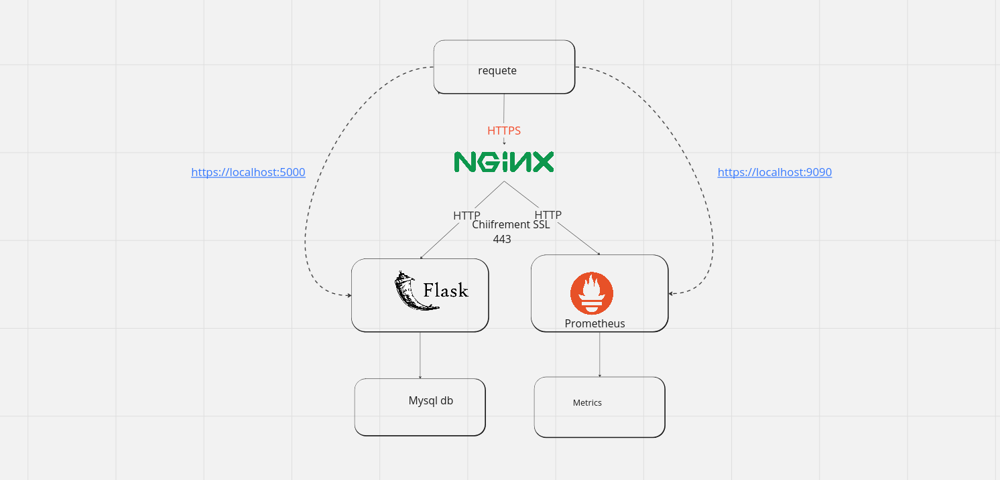
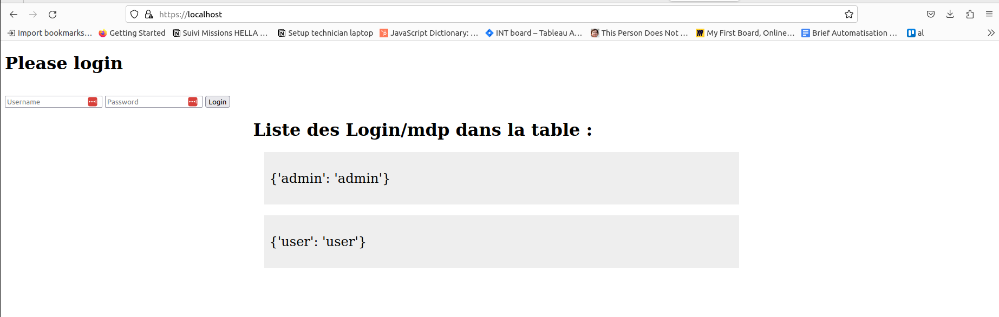
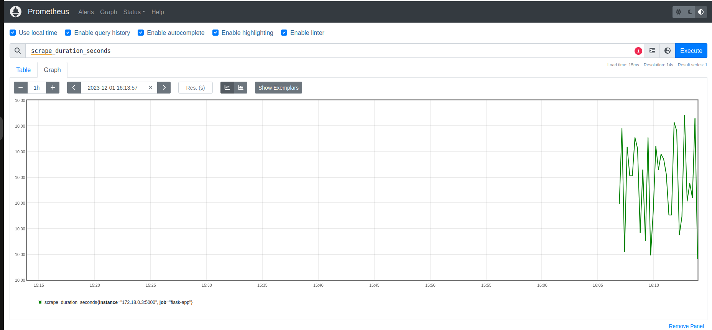

# Projet DockerCompose avec Nginx et Prometheus

Ce projet vise à déployer une application Flask avec Nginx pour la partie https et Prometheus pour la surveillance des métriques.

## Services inclus dans le docker-compose.yml

### 1. Service app

Le service `app` représente votre application Flask. Il est construit à partir du répertoire `./app` et est lié au service `db` pour la base de données. Il écoute sur le port 5000.

### 2. Service db

Le service `db` utilise l'image MySQL 5.7, exposant le port 3307.

### 3. Service nginx

Le service `nginx` utilise l'image Nginx ( à telecharger), exposant les ports 80 et 443. Il est configuré avec un fichier `nginx.conf` situé dans `./nginx` et des certificats SSL dans `./nginx/certificates`.

### 4. Service prometheus

Le service `prometheus` utilise l'image Prometheus ( à telecharger) et expose le port 9090. Il est configuré avec un fichier `prometheus.yml` situé dans `./path/to/prometheus.yml`. 

### 4. Schema


## Exécution du projet

1. Clonez ce dépôt :
   ```bash
   git clone https://github.com/samiHEL/Docker_App_Deployment.git
2. cd Docker_App_Deployment
3. docker-compose up -d
4. Accédez à votre application Flask : https://localhost:5000
5. Accédez à l'interface de monitoring Prometheus :https://localhost:9090

## Annexes





