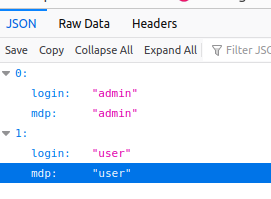

# Projet DockerCompose FRONT Streamlit BACK Flask BDD Mysql

Ce projet vise à déployer une application Flask qui posséde un front streamlit et une bdd mysl ( Requete Api entre le front et le back )

## Services inclus dans le docker-compose.yml

### 1. Service backend

Le service `app` représente votre application Flask. Il est construit à partir du répertoire `./app` et est lié au service `db` pour la base de données.

### 2. Service db

Le service `db` utilise l'image MySQL 5.7, exposant le port 3307.


### 4. Service frontend

Partie Streamlit faisant des appels api depuis l'endpoint http://backend:5000/ .

### 5. Login


### 6. Update Login


## Exécution du projet

1. Clonez ce dépôt :
   ```bash
   git clone https://github.com/samiHEL/Docker_App_Deployment.git
2. cd Docker_App_Deployment
3. docker-compose up -d


## Annexes

### Json


### Exemple erreur 


